# web-app-foodmap

Dessert Map is a web-app that through of a selector can filter the dessert restaurants according to your favorite dessert.

## Desarrollado para 
[Laboratoria](http://laboratoria.la)

## Tools
* HTML
* CSS
* Framework bootstrap
* Jquery
* Api google maps

## Environment
The project was worked on the Windows 10 operating system (64 Bits).

## Filters
 The subject that gives in this application is about desserts and the filters are as follows:
-  chocotejas
-  caramel sandwich cookies
-  cupcakes
-  cookies
-  ice creams
-  Porridge
-  picarones
-  Salted Caramel Pinwheel cookies
- sanguito
- suspiro
- cakes

## Flow of the application
1. Splash view: This view is available for 4 seconds.
 - Mobile view

    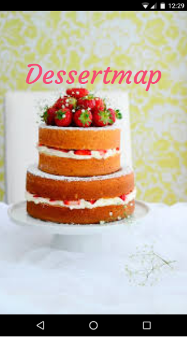

  - Desktop view

    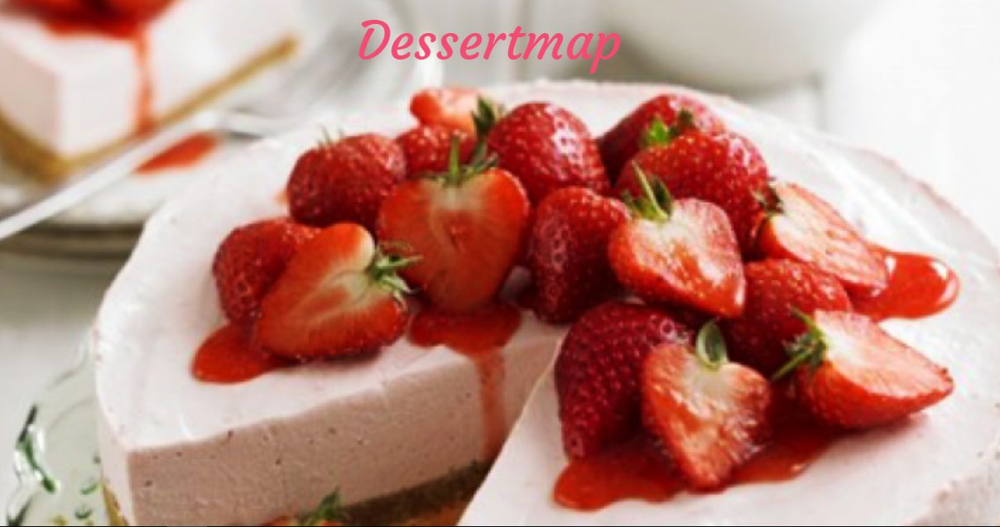

2. Main view: This view has a filter to select the desserts you want
 - Mobile view

    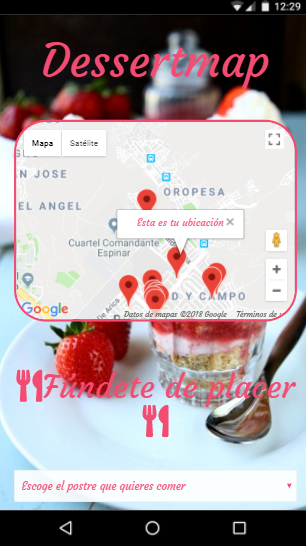

 - Desktop view

    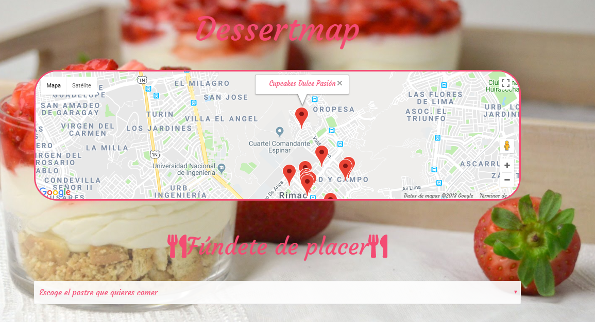

3. Desert restaurants near you: The application offers depending on your location nearby places that offer desserts.
 - Your location

    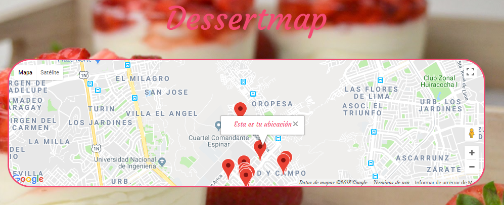

 - Nearby places

    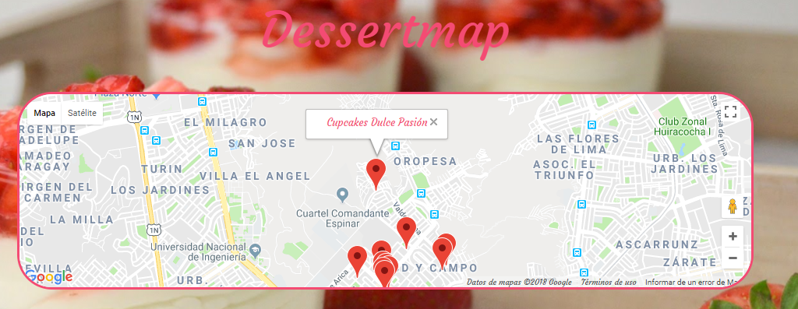

    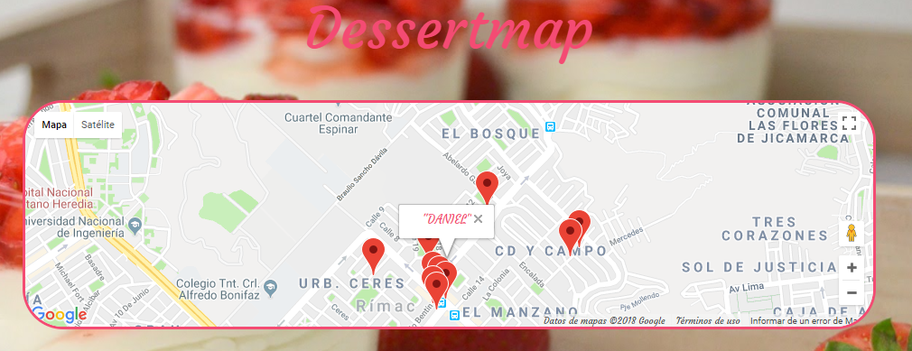

4. Result: The result of the filter is presented as follows:

 - Mobile view

    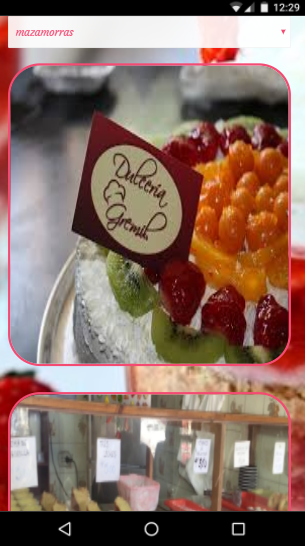

  - Desktop view

    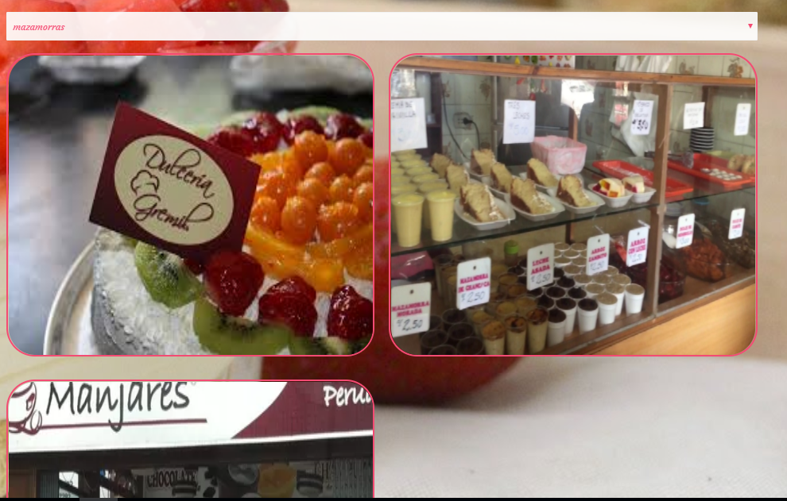

  - Effect in desktop view

    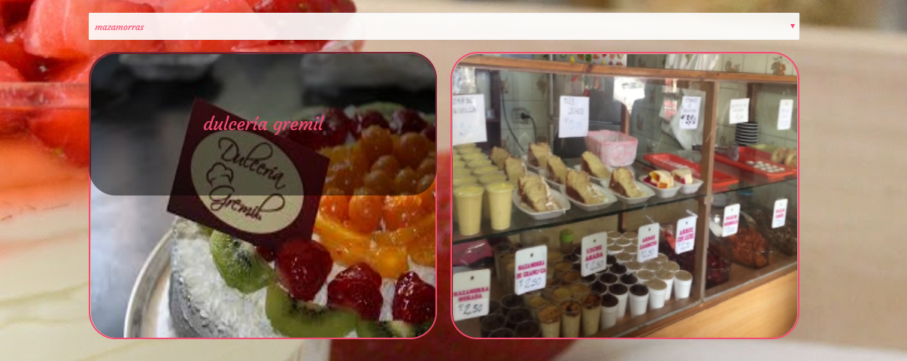

    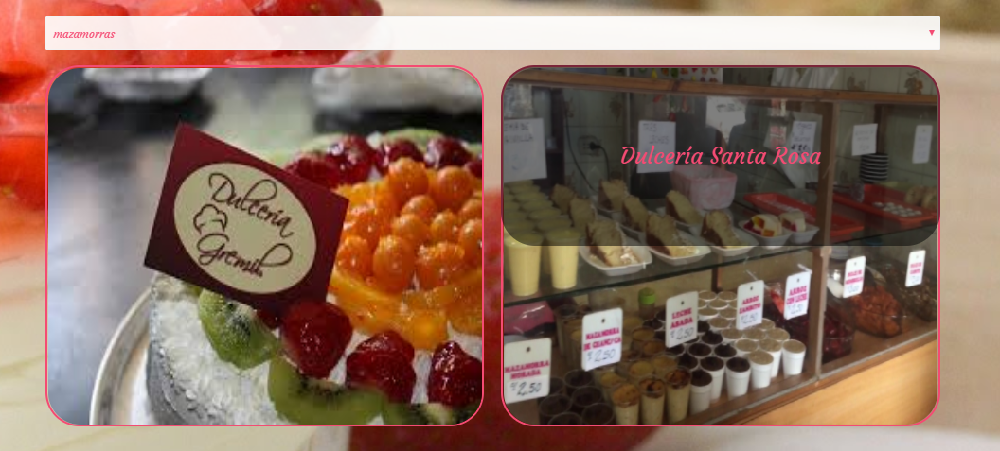

5. Information about dessert restaurants: by clicking on the dessert restaurant,shows the following:
  - Location about the place
  - Web page

  - Mobile view

    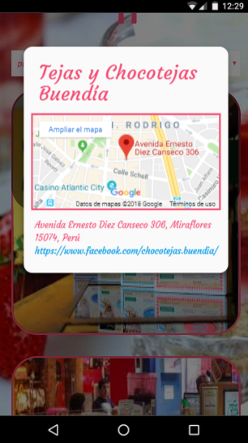

  - Desktop view

    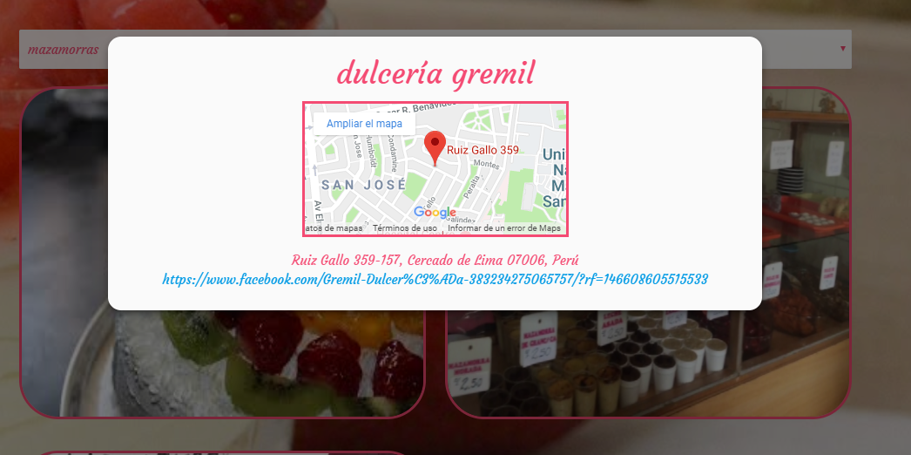
    
 ## Bibliographical sources
 - [Api google maps](https://developers.google.com/maps/documentation/javascript/places?hl=es-419)
