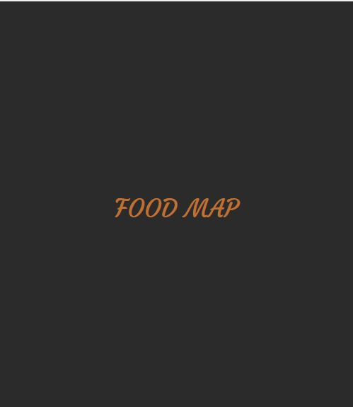
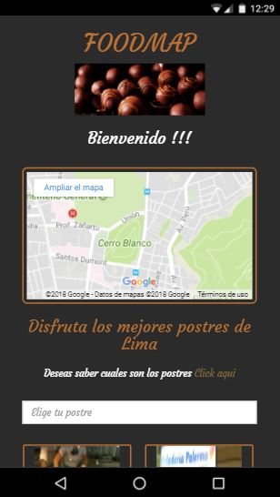
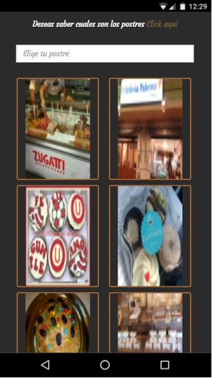
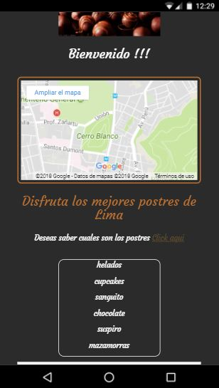
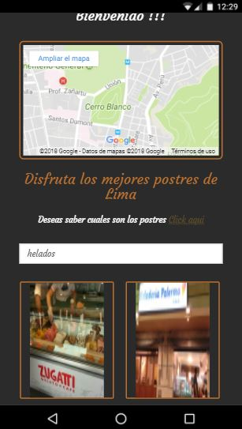

# Reto FOODMAP

## Objetivo
Crea una web-app que a través de un input pueda filtrar los restaurantes que se encuentran cerca de ti.
## Herramientas

* HTML
* CSS
* Framework bootstrap
* Jquery

##filtros
El tema que da a en esta aplicación es sobre postres y el filtro es de la siguiente manera:
-  helados
- cupcakes
-  sanguito
-  chocolate
-  suspiro
-  mazamorras

## Flujo de la aplicación
1. Vista splash: Esta vista estás disponible por 4 segundos

2. Vista principal: Esta vista tiene un filtro para seleccionar los postres que desees

* Como extra y para ayudar al cliente se le ofrece la opción de un mensaje de ayuda para que conozca los filtros

* El resultado del filtro se presenta de la siguiente manera:

